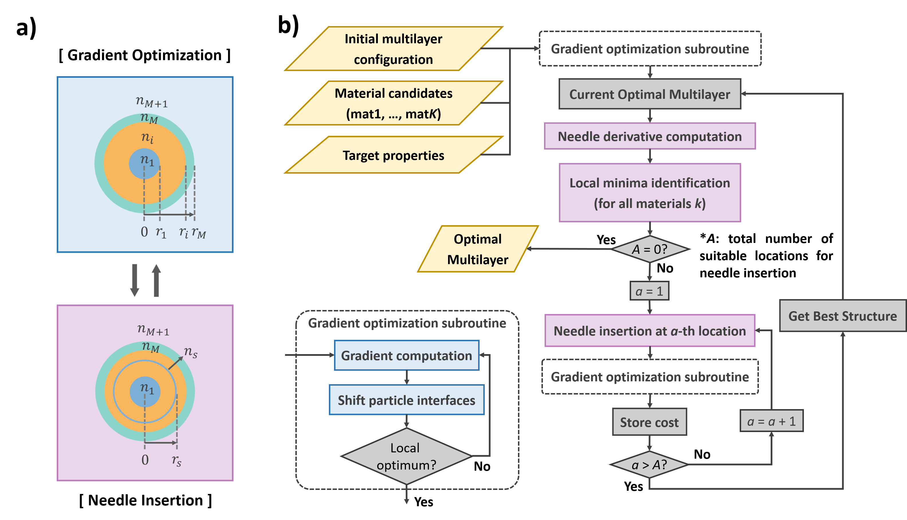

# Eschallot: Comprehensive Package for the Simulation and Optimization of Spherical Particles

Eschallot is an optimization and simulation tool for light scattering by stratified spherical nano-and microparticles, inspired by the needle optimization algorithm used for multilayer thin-film design **[1-3]**. The algorithm alternates between **(a) Shape Optimization** (optimizing the layer boundary positions by gradient descent) and **(b) Topology Nucleation** (optimizing the materials and the number of layers by nucleating an infinitesimal layer at an optimal location) to minimize a user-defined cost function based on the particle's far-field scattering quantities (cross-sections, phase functions, etc.). These quantities are computed in each iteration using the transfer matrix method formulation of Mie scattering for multi-shell particles **[4-5]**.

If you have found this code to be helpful in your research, please consider citing:

(to be added)

**References:**

**[1]** A. V. Tikhonravov, M. K. Trubetskov, G. W. DeBell, Application of the needle optimization technique to the design of optical coatings, Appl. Opt. 35, 5493-5508 (1996).

**[2]** S. Larouche, L. Martinu, OpenFilters: open-source software for the design, optimization, and synthesis of optical filters, Appl. Opt. 47, C219-C230 (2008).

**[3]** M. Trubetskov, Deep search methods for multilayer coating design, 59, A75-A82 (2020).

**[4]** A. Moroz, A recursive transfer-matrix solution for a dipole radiating inside and outside a stratified sphere, Ann. Phys. 315, 352-418 (2005).

**[5]** I. Rasskazov, P. Carney, A. Moroz, STRATIFY: a comprehensive and versatile MATLAB code for a multilayered sphere, OSA Contin. 3, 2290 (2020).

# Tutorial

**1. Defining the cost function**

**2. Running the optimization** `run_needle_optimization.py`

- To define a custom cost function, change the variables in 'radius_sweep'

- To define a custom range for the initial particle radius, change the inputs to 'radius_sweep' (under "if __name__ == '__main__'")

**3. Computing far-field scattering quantities**

**4. Simulating particle-dispersed random media**

# Requirements

- NumPy

- SciPy

- Matplotlib

- Numba

- mpi4py
